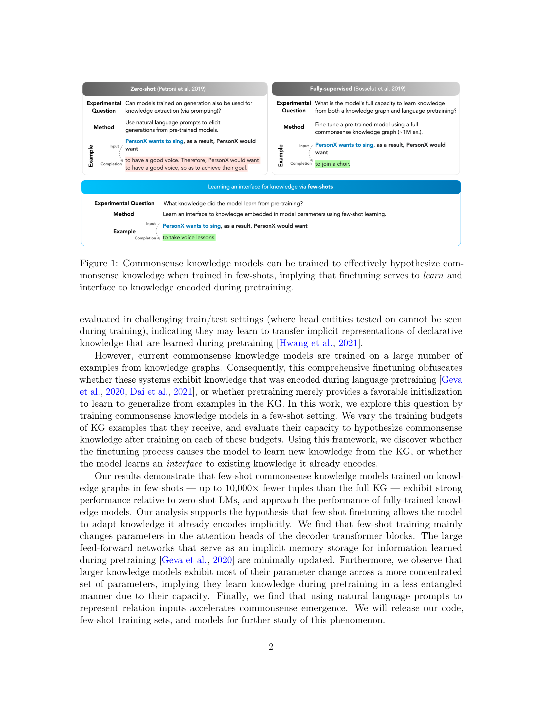

# [Analyzing Commonsense Emergence in Few-shot Knowledge Models](https://arxiv.org/abs/2101.00297)

This repository contains code for Analyzing Commonsense Emergence in Few-Shot Knowledge Models (AKBC 2021). The repository is organized in two sections in accordance with the paper format:

- Section 4 contains code, trained models, and training data for few-shot analysis of model analysis
- Section 5 contains code for generating the analysis on L1 distances, angular distance, and AUC curve heatmaps.

Since the codebases are mostly independent, please refer to the `README.md` in each corrasponding folder for information on setting up your enviroment, downloading files, and running scripts.